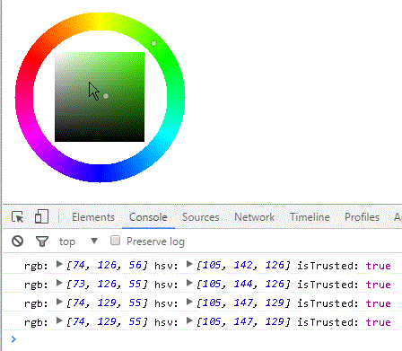

# ANColorPicker
javascript plain color picker

## Supported Browsers
Only Chrome
(& may works on Firefox)

## Usage

    const ancp = new ANColorPicker()
    document.body.appendChild(ancp.getContainer())
    ancp.onChange(({rgb, hsv, isTrusted})=>console.log("rgb:",rgb, "hsv:",hsv, "isTrusted:",isTrusted))
    
    // set a color from outside
    ancp.setColor(200,100,50)

---

    const ancp = new ANColorPicker(size=200)

    ancp.getContainer()

    ancp.setColor(r,g,b)
      -- 0 <= r,g,b <= 255

    ancp.setColorHsv(h,s,v)
      -- 0 <= h <= 360
         0 <= s,v <= 255

    ancp.onChange(callback)
      -- callback : ({rgb, hsv, isTrusted})=>{ ... }
  
## License

MIT
